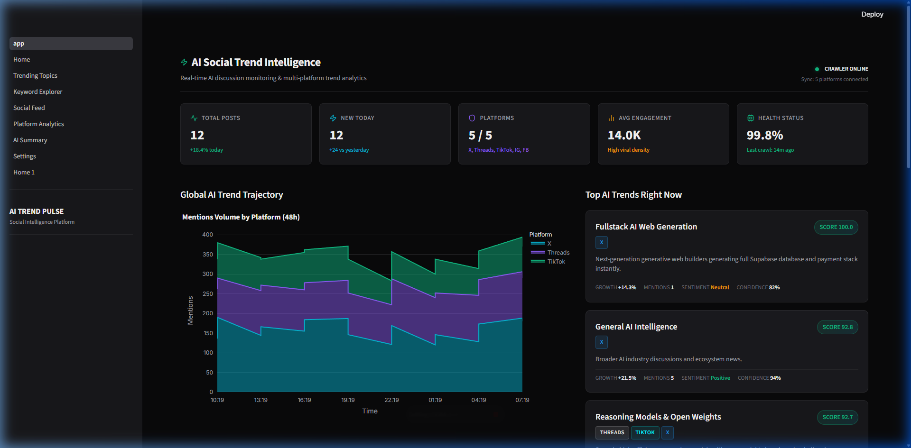
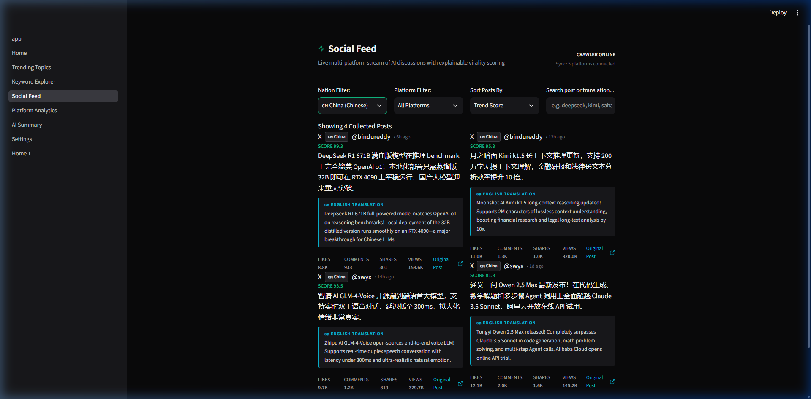

# AI Social Media Scraper & Trend Intelligence Dashboard

A modern, local intelligence dashboard built with Streamlit, Python, and SQLite. It aggregates, filters, and analyzes AI-related discussions from multiple social platforms (X, Threads, TikTok, Instagram, Facebook), converting raw social noise into actionable trend metrics and executive digests.

Designed with a minimal dark UI inspired by Linear and Vercel.

---

## Preview & Dashboard Screenshots

### Main Intelligence Dashboard


### Multi-Nation Filter & Chinese English Translation Cards


---

## Key Features

- **Multi-Nation & Multi-Language Support**: Filter posts by nation (🌐 **International / English**, 🇨🇳 **China / Chinese**, 🇮🇩 **Indonesia / Indonesian**). Chinese posts automatically include clean **English Translation Cards**.
- **Multi-Platform Adapters**: Decoupled crawler architecture supporting X (Twitter), Threads, TikTok, Instagram, and Facebook. Each adapter returns a unified schema so platform failures do not block the pipeline.
- **Explainable Scoring Engine**: Computes multi-factor trend scores derived from engagement volume, time-decay freshness, virality rate, and platform weights.
- **NLP & Deduplication**: Vector cosine similarity (TF-IDF) filters out duplicate cross-posted content while clustering related posts into distinct AI topics.
- **Entity Extraction**: Automatically parses mentioned AI models (Claude 3.7, DeepSeek R1, Gemini 2.0, GPT-4.5), frameworks (PyTorch, LangChain, CrewAI), and tools (Cursor, Lovable.dev).
- **OpenRouter LLM Integration**: Generates daily AI summaries, emerging tool breakdowns, and company activity reports with structured fallback logic.
- **Dark Visualizations**: Custom Plotly dark charts (Line, Area, Heatmap, Treemap, Bar) built without bloated chart types.

---

## System Architecture

```text
AI Social Media Scraper/
├── app.py                 # Streamlit entry point & navigation routing
├── pages/                 # Clean 8-Page Navigation (Home, AI News Reader, Trending Topics, Keywords, Reddit Community, Analytics, Summary, Settings)
├── models/                # Dataclasses (Post, ScoredPost, Topic, PlatformMetrics)
├── crawler/               # Standardized platform adapters (SocialCrawl + Reddit RSS + Live News RSS)
├── scoring/               # Multi-factor explainable trend scoring engine
├── analyzer/              # TF-IDF deduplication, topic clustering, & OpenRouter client
├── services/              # Threaded crawler pipeline & report orchestration
├── database/              # SQLite manager with WAL mode and indexing
├── components/            # Reusable UI cards, metric scorecards, & Lucide SVG icons
├── utils/                 # Plotly dark theme chart factories & formatters
├── tests/                 # Unit test suite (test_models, test_scoring, test_db)
└── assets/                # Dark theme stylesheet & page screenshots
```


---

## Running Unit Tests

The repository includes a standalone unit test suite covering data models, scoring engine formulas, and database operations.

Run the test suite using Python's built-in `unittest` runner:

```bash
python -m unittest discover -s tests
```

Or run via `pytest` if installed in your environment:

```bash
pytest
```


---

## Scoring Engine Mechanics

Every post is scored using a linear combination of normalized metrics:

$$\text{Trend Score} = \left( 0.35 \times S_{\text{virality}} + 0.25 \times S_{\text{engagement}} + 0.25 \times S_{\text{freshness}} + 0.15 \times S_{\text{authority}} \right) \times W_{\text{platform}}$$

- **Engagement ($S_{\text{engagement}}$)**: Logarithmically scaled interaction sum (likes, comments, shares, views).
- **Virality ($S_{\text{virality}}$)**: Engagement growth velocity scaled by post age.
- **Freshness ($S_{\text{freshness}}$)**: Exponential half-life decay ($e^{-0.04 \times \text{hours}}$).
- **Platform Weight ($W_{\text{platform}}$)**: Configurable multiplier per source channel (X: 1.2, Threads: 1.1, TikTok: 1.0, Instagram: 0.9, Facebook: 0.8).

---

## Quickstart Guide

### Prerequisites
- Python 3.10+
- `pip` / `venv`

### Installation

1. **Clone & Setup Virtual Environment**:
   ```bash
   git clone <your-repo-url>
   cd "AI Social Media Scraper"
   python -m venv .venv
   ```

2. **Activate Environment & Install Dependencies**:
   - **Windows (PowerShell)**:
     ```powershell
     .venv\Scripts\Activate.ps1
     pip install -r requirements.txt
     ```
   - **Linux / macOS**:
     ```bash
     source .venv/bin/activate
     pip install -r requirements.txt
     ```

3. **Run Application**:
   ```bash
   streamlit run app.py
   ```
   Open your browser at `http://localhost:8501`.

---

## Configuration

- **OpenRouter API Key**: Set your key in `Settings > API & LLM Config` or export `OPENROUTER_API_KEY` in your shell environment.
- **Keywords**: Manage tracked terms (e.g. `ChatGPT`, `Claude`, `Cursor`, `DeepSeek`, `Lovable`) in `Settings > Tracked Keywords`.

---

## License

MIT License.
